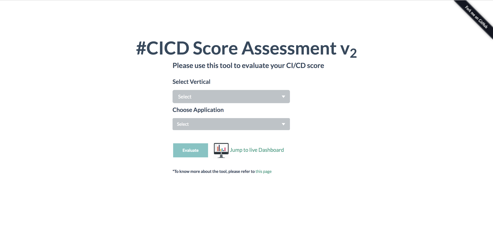
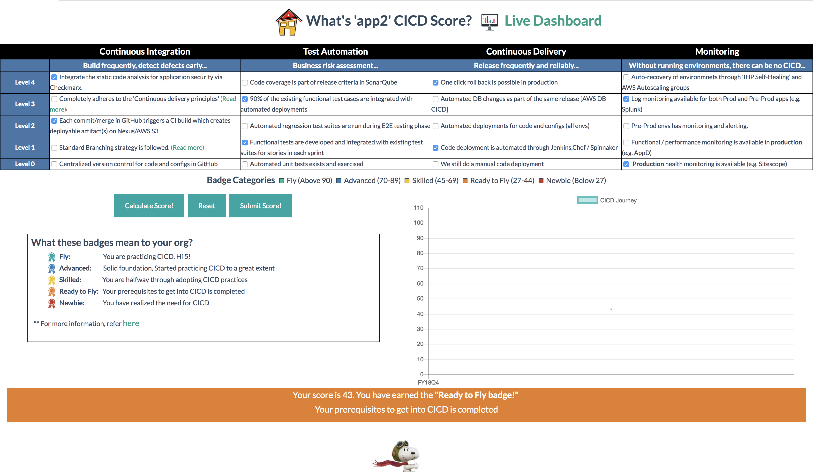
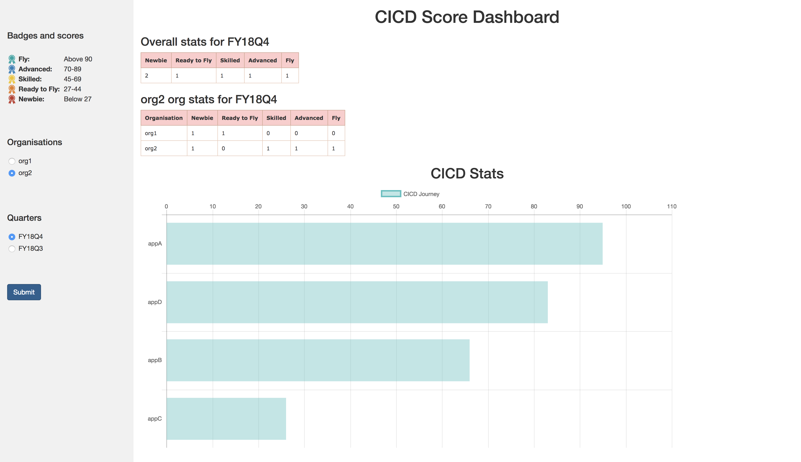
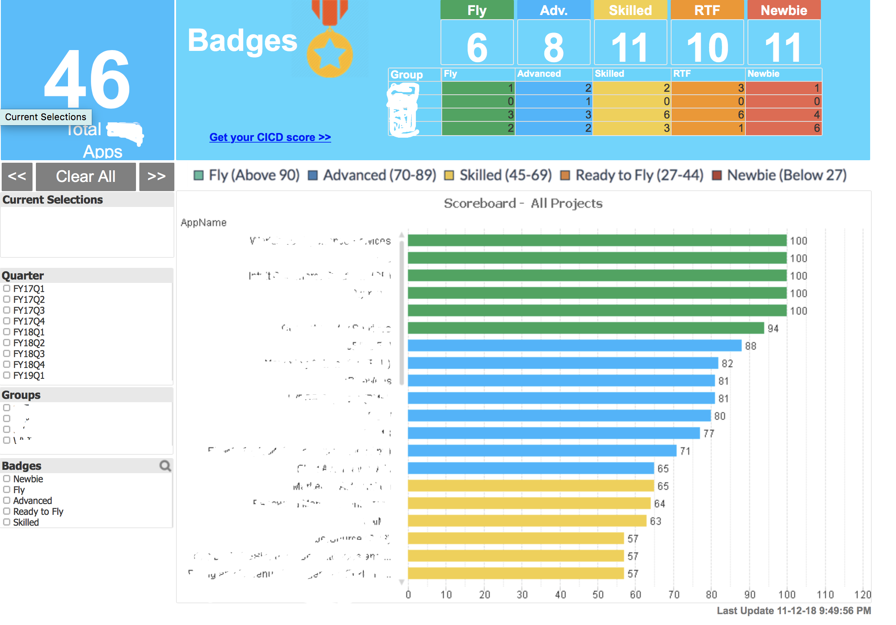

#  CICD SCORE

<a href="https://circleci.com/gh/intuit/CICDscore">
        
</a>

CICD adds Speed to our release cycles. While adopting CICD , most of the time we don’t know what areas to target for to be really practicing CICD at scale.  At the org level , how do we measure our overall CICD adoption and  maturity has been a pain point.
  
Measurement removes subjectivity , and helps us to focus and strategize in an objective way. 
 
This framework allows us to evaluate the CI/CD score for any application , and also projects the scores in a journey line graph along with some nice and fun badges!
 
The landing page is the CICD  checklist , which is refreshed on a regular basis - allows us to evaluate the score for any given app. During the assessment the app team will  earn points against each qualifying items, and the underlying engine derives a total score and awards a qualifying badge.  There is also a live graph which tells about the journey-line of the app on how this application has been  maturing over time in their CICD practices.  The scores in the backend database for entire org  is then used to display the score cards and respective badges via a QlikView dashboard , which gives direction and also builds a momentum creating a healthy Network Effect.

## Getting Started

These instructions will get you a copy of the project up and running on your local machine for development and testing purposes. 

### Prerequisites

The application is built using HTML, CSS, JavaScript, PHP and requires LAMP(linux)/MAMP(Mac)/WAMP(Windows) server to run. 

[Install MAMP stack](https://www.mamp.info/en/) for Mac

[Install LAMP stack](http://www.ampps.com/LAMP) for Linux

[Install WAMP stack](http://www.ampps.com/WAMP) for Windows

### Database

Create database 'cicdscore' and update the password in the connect_to_db.php file

```
create database cicdscore;
```

Create the following tables:
1. all_apps (List of all application under each organisation. You are required to populate this table manually. )

```
CREATE TABLE all_apps (
organisation VARCHAR(30),
application VARCHAR(30),
PRIMARY KEY (organisation, application)
);
```
Example insert statements:
```
* INSERT INTO `all_apps` (`organisation`, `application`) VALUES ('org1', 'app1');
* INSERT INTO `all_apps` (`organisation`, `application`) VALUES ('org1', 'app2');

```
2. scores (Stores the score of application quarter-wise. Updates the same entry if the score is submitted twice in the same  quarter. The application updates this table automatically.)
```
CREATE TABLE scores (
organisation VARCHAR(30),
application VARCHAR(30),
quarter VARCHAR(6),
score VARCHAR(3),
badge VARCHAR(15),
composition VARCHAR(30),
PRIMARY KEY (organisation, application,quarter)
);
```
3. score_composition (Stores the pointers checked to pre-populate the page on load with the previous score submitted. The application updates this table automatically.)
```
CREATE TABLE score_composition (
organisation VARCHAR(30),
application VARCHAR(30),
composition VARCHAR(30),
PRIMARY KEY (organisation, application)
);
```

We at our group use an internal tool called Qlikview to graphically represent the scores in a dashboard. We have provided a php module which does the same here. Feel free to add more filters or change the layout according to your requirements. (Ref: dashboard.php)

# Launching the Application as a Docker container:

$ docker run -d -p 8082:80 cicdscore/cicdscore

This will run the container in detached mode, to execute SQLs you can attach to the container and run the queries as below:

$ docker exec -it container-name bash 

$ root@container-id:/# mysql -u root -p
Enter password: <default password is root>
  
Welcome to the MySQL monitor.  Commands end with ; or \g.
Your MySQL connection id is 69
Server version: 5.5.41-0ubuntu0.14.04.1 (Ubuntu)

Copyright (c) 2000, 2014, Oracle and/or its affiliates. All rights reserved.

Oracle is a registered trademark of Oracle Corporation and/or its
affiliates. Other names may be trademarks of their respective
owners.

Type 'help;' or '\h' for help. Type '\c' to clear the current input statement.

mysql> <queries here> ;


## How the application will look like:
Landing page:


## Application score:


## Dashboard:


## The original QlikView Dashboard looks like this:


## Steps to contribute:

1. Fork this repository into your account on GitHub.
2. Clone *your forked repository* (not our original one) to your hard drive with `git clone https://github.com/YOURUSERNAME/mycicdscore`.
3. Design and develop your changes.
4. Test the changes and features added. 
5. Create a pull request for review to request merge.
6. Obtain approval before your changes can be merged.


Thank you for your contribution!
